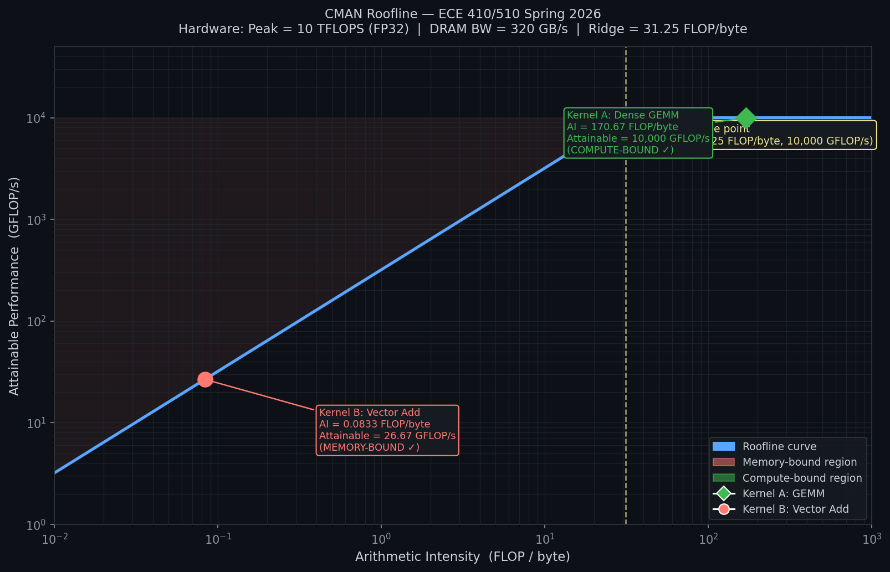

# CMAN Roofline Analysis
**ECE 410/510 HW4AI — Spring 2026 — Codefest 2**
**CMAN completed without AI assistance**

---

## Given Data

| Parameter | Value |
|---|---|
| Peak Compute | 10 TFLOPS (peak point) |
| P_peak | 10,000 GFLOP/s (∵ 1 TFLOPS = 1000 GFLOP/s) |
| DRAM Bandwidth | B = 320 GB/s |
| Ridge Point | P_peak / B = 10,000 / 320 = **31.25 FLOP/byte** |

**Classification rule:**
- Below 31.25 FLOP/byte → **Memory-bound (DRAM)**
- Above 31.25 FLOP/byte → **Compute-bound (Peak FLOPS)**

---

## Task 1 - Roofline Diagram

**Bandwidth-limited region:**
```
P = Arithmetic Intensity × B
P = AI × 320 GB/s
```

**Compute-limited ceiling:**
```
P = P_peak = 10,000 GFLOP/s
```

**Ridge Point = (31.25 FLOP/byte, 10,000 GFLOP/s)**



*x-axis → FLOP/byte (Arithmetic Intensity), log scale*
*y-axis → GFLOP/s (Attainable Performance), log scale*
*Diagonal slope: BW = 320 GB/s | Flat ceiling: P_peak = 10,000 GFLOP/s*
*Ridge point labeled at (31.25, 10,000)*
*Kernel A (GEMM) plotted at AI = 170.67 → on compute ceiling*
*Kernel B (Vector Add) plotted at AI = 0.083 → on bandwidth slope*

---

## Task 2 — Kernel A: Dense GEMM (1024 × 1024, FP32)

**FLOPs:**
```
FLOPs = 2 × N³
      = 2 × (1024)³
      = 2,147,483,648 FLOPs
```

**Bytes Transferred (no cache reuse, all 3 matrices A, B, C from DRAM):**
```
One matrix = 1024 × 1024 × 4 = 4,194,304 bytes
3 matrices = 3 × 4,194,304   = 12,582,912 bytes
```

**Arithmetic Intensity (AI):**
```
AI = FLOPs / Bytes
   = 2,147,483,648 / 12,582,912

AI = 170.67 FLOP/byte
```

**Classification:**
```
170.67 > 31.25 → Compute-bound (it's above the ridge point)
```

**Attainable Performance:**
```
= P_peak = 10,000 GFLOP/s  (hits the compute ceiling)
```

---

## Task 3 — Kernel B: Vector Addition (N = 4,194,304, FP32)

**FLOPs** *(one add per element)*:
```
FLOPs = N = 4,194,304 FLOPs
```

**Bytes Transferred (no cache reuse, read A, read B, write C):**
```
One vector = 4,194,304 × 4 = 16,777,216 bytes
3 vectors  = 3 × 16,777,216 = 50,331,648 bytes
```

**Arithmetic Intensity (AI):**
```
AI = FLOPs / Bytes
   = 4,194,304 / 50,331,648

AI = 0.083 FLOP/byte
```

**Classification:**
```
0.083 < 31.25 → Memory-bound (it's below the ridge point)
```

**Attainable Performance:**
```
= 320 × 0.083 = 26.67 GFLOP/s
```

---

## Task 4 — Classification and Architectural Recommendations

### Kernel A: GEMM

| Item | Value |
|---|---|
| (a) Bound | **Compute-bound** (170.67 > 31.25) |
| (b) Attainable Performance | **10,000 GFLOP/s** (hits compute ceiling) |
| (c) Recommendation | Add tensor cores and more MAC units. GEMM is compute-bound so more FP32 throughput directly raises performance. More bandwidth would NOT help here. |

### Kernel B: Vector Addition

| Item | Value |
|---|---|
| (a) Bound | **Memory-bound** (0.083 < 31.25) |
| (b) Attainable Performance | **26.67 GFLOP/s** (320 × 0.083) |
| (c) Recommendation | Switch to High Bandwidth Memory (HBM). Vector add does 1 FLOP per 12 bytes — compute units sit idle waiting for data. More ALUs would NOT help; bandwidth is the bottleneck. |
